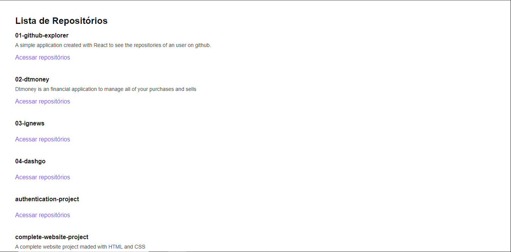

<h1 align="center"> github-explorer </h1>

  <a href="#-tecnologias">Tecnologias</a>&nbsp;&nbsp;&nbsp;|&nbsp;&nbsp;&nbsp;
  <a href="#-projeto">Projeto</a>&nbsp;&nbsp;&nbsp;|&nbsp;&nbsp;&nbsp;
  <a href="#memo-licença">Licença</a>

  

 

  

## 🚀 Tecnologias

Esse projeto foi desenvolvido com as seguintes tecnologias:

- React
- TypeScript
- Sass

## 🔥 Algumas features neste projeto

- React Hooks
- UseState
- UseEffect
- Fetch API
- Estilização com Sass

## ✨ Neste projeto você pode ver

- Uma lista com os repositórios do usuário pesquisado.
- Um link que direciona para o repositório listado.

## 💻 Projeto

- Está uma aplicação simples para encontrar os repositórios de um usuário no Github

## ✅ Esse projeto foi criado ao longo do curso Ignite ReactJS da plataforma Rocketseat

## 📝 Licença

Esse projeto está sob a licença MIT.

---
